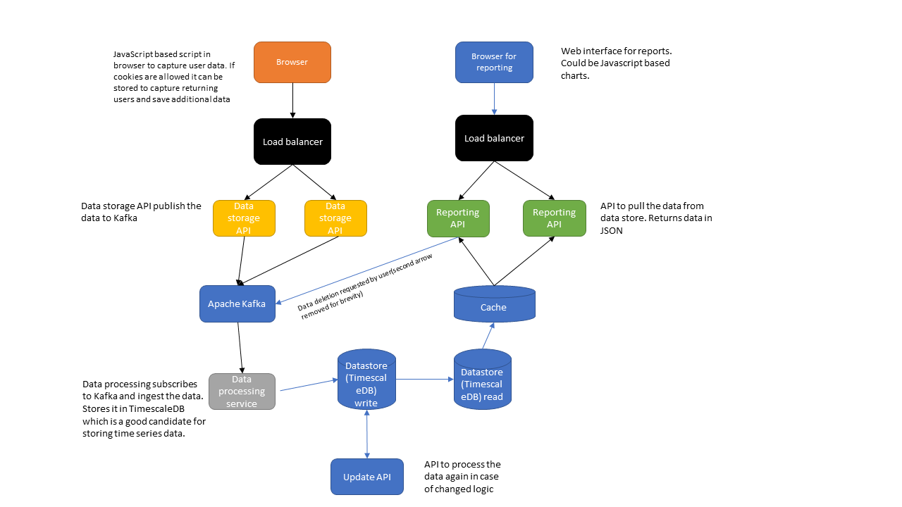

# Design Question

Design a Google Analytics backend system.

### Assumptions

1. 4 billion write events per day.
2. 100 million read events per day.
3. The network is not uniformly distributed and there could be spikes in the requests.
4. The data is time series based, and the backend is heavily focused on writes.
5. 1 hour time lag is acceptable in reporting. It means there is no need of real time reporting.
6. Downtime should be minimized.
7. Ability to reprocess historical data. However, these events would be rare.
8. The user cannot edit the data. However, user can request to delete the data.

### High level design diagram

If the image doesn't load it can be found with name [Google_Analytics.png](Google_Analytics.png) 

### Additional information

##### Data storage

- The client uses a javascript file on their website which sends a xhr request to the Data storage API.
- The API has a load balancer, and it is horizontally scalable. It can be a microservice in Spring boot in dockerized container.
- The API pushes the events to Apache Kafka stream. Kafka is also horizontally scalable so it can handle the spikes in requests.
- Data processing service subscribes to the Apache Kafka and ingests the data into the data store.
- For data storage Timescale DB is a good candidate as we are storing time series database.
- TimescaleDB provides SQL queries to select, insert and update data. This is an easy interface to work with.
- The databases are divided into write-read configuration. Read database syncs with the write database and used purely for reporting.
- Other candidates can be InfluxDB, but Influx DB has no easy way of updating the time series data.
- We are assuming that re processing of data is rare and can only be triggered by admins. If updates are frequent they can degrade the read/write performance of the DB 

##### Data reporting

- The Reporting API is independent of the  data storage API.
- It utilizes a load balancer and is horizontally scalable. 
- The API requests data from the Influx DB and displays it to the user.
- There is an additional cache layer which caches the data to decrease the read times.
- If the user requests to delete the data. The request will go to Kafka which data processing service will pickup and delete the data.

### Approximate numbers

- Assuming 2KB of data per write (URL, Client ID, visitor parameters) and 4 billion total writes per day = 8 TB of write per day or ~47,000 events per second
- For reading 2KB * 100 million read events * 30 data points read per request = 6 TB per day or ~1200 read events per second.
- Clearly we would need some sort of sharding for the database. As the size of database is huge.
- A sharding strategy which could be used in this scenario is geography based sharding. Which will divide the data based on the clients website location.
- So all the websites from US will have a dedicated server and all websites from EU could have another. The servers could be further combined or divided based on the size.
- For example - Lot of small countries with less number of websites can be combined to form one single server. US on the other hand could be further divided into regions.
- This will complicate the logic on the application level side but given the size of the data. I think it is an acceptable trade off.    

